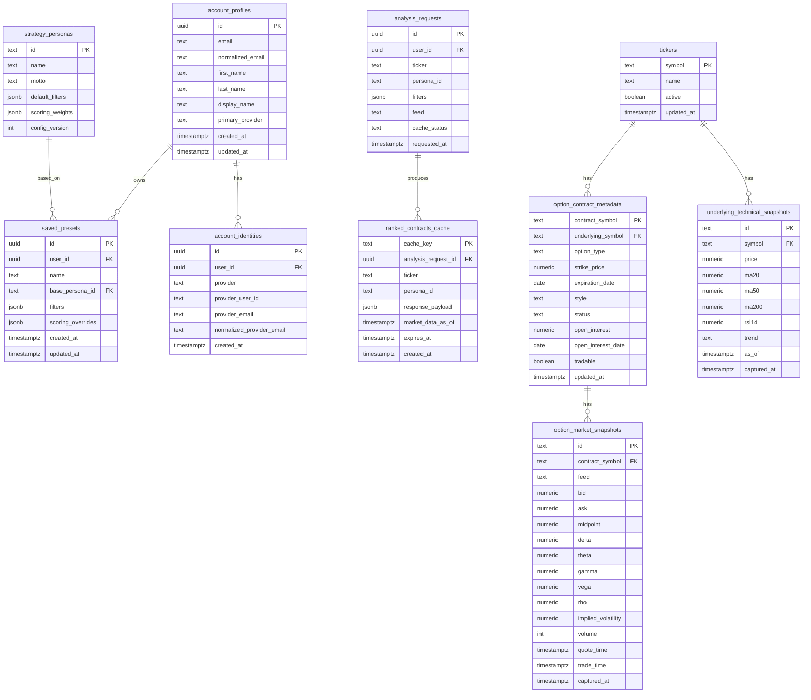

# Wheel Strategy Dashboard — Data Model Specification

**Database:** PostgreSQL  
**Cache:** Redis/KV recommended  
**MVP mode:** Single-user or private beta, multi-user-ready schema

---

## 1. Modeling Principles

- Normalize Alpaca responses into internal domain entities.
- Persist user/saved preset data permanently.
- Cache market data with TTLs; do not treat cached quotes as permanent truth.
- Keep scoring outputs reproducible by recording persona config version.
- Make future portfolio-aware features possible without redesign.

---

## 2. Core Entities



---

## 3. Tables

### 3.1 `strategy_personas`

Stores system-defined persona defaults.

| Column | Type | Notes |
|---|---|---|
| `id` | text PK | `conservative_wheel`, `balanced_wheel`, `aggressive_yield`, etc. |
| `name` | text | Display name. |
| `motto` | text | UI subtitle. |
| `default_filters` | jsonb | DTE, delta, liquidity, earnings behavior. |
| `scoring_weights` | jsonb | Weight map for scoring engine. |
| `config_version` | int | Increment when defaults change. |
| `created_at` | timestamptz | Audit. |
| `updated_at` | timestamptz | Audit. |

### 3.2 `account_profiles`

Stores application-required account profile data for Supabase Auth users.
`auth.users` remains managed by Supabase and is the source of truth for login
identity.

| Column | Type | Notes |
|---|---|---|
| `id` | uuid PK/FK | References `auth.users(id)` with cascade delete. |
| `email` | text | Required account email. |
| `normalized_email` | text unique | Generated by trimming whitespace and lowercasing `email`. |
| `first_name` | text | Required before account-owned features are available. |
| `last_name` | text | Required before account-owned features are available. |
| `display_name` | text nullable | Optional UI-friendly name. |
| `primary_provider` | text nullable | Google, Apple, email, or another Supabase provider. |
| `created_at` | timestamptz | Audit. |
| `updated_at` | timestamptz | Maintained by trigger on profile updates. |

### 3.3 `account_identities`

Optional provider-level identity tracking for cases where Supabase identities
need app-visible duplicate/provider-linking context.

| Column | Type | Notes |
|---|---|---|
| `id` | uuid PK | Identity row ID. |
| `user_id` | uuid FK | References `auth.users(id)` with cascade delete. |
| `provider` | text | Provider key, such as `google`, `apple`, or `email`. |
| `provider_user_id` | text | Provider-specific stable subject/user ID. |
| `provider_email` | text nullable | Email returned by provider. |
| `normalized_provider_email` | text nullable | Generated trim+lowercase provider email. |
| `created_at` | timestamptz | Audit. |

### 3.4 `saved_presets`

Stores reusable user filter presets.

| Column | Type | Notes |
|---|---|---|
| `id` | uuid PK | Preset ID. |
| `user_id` | uuid | Required account owner. References `account_profiles(id)`. |
| `name` | text | User-defined preset name. |
| `base_persona_id` | text FK | Persona used as baseline. |
| `filters` | jsonb | Filter overrides. |
| `scoring_overrides` | jsonb nullable | Future custom score weights. |
| `created_at` | timestamptz | Audit. |
| `updated_at` | timestamptz | Audit. |

### 3.5 `option_contract_metadata`

Stores relatively stable option contract data.

| Column | Type | Notes |
|---|---|---|
| `contract_symbol` | text PK | Alpaca/OSI option symbol. |
| `underlying_symbol` | text index | Equity ticker. |
| `option_type` | text | `call` or `put`. |
| `strike_price` | numeric | Contract strike. |
| `expiration_date` | date | Expiration. |
| `style` | text | Usually `american` for US equity options. |
| `status` | text | `active` / `inactive`. |
| `open_interest` | numeric nullable | From Alpaca contracts endpoint when available. |
| `open_interest_date` | date nullable | OI freshness. |
| `tradable` | boolean nullable | Contract tradability. |
| `updated_at` | timestamptz | Metadata refresh time. |

Indexes:

```sql
CREATE INDEX idx_option_contracts_underlying_type_exp
ON option_contract_metadata (underlying_symbol, option_type, expiration_date);

CREATE INDEX idx_option_contracts_strike
ON option_contract_metadata (underlying_symbol, strike_price);
```

### 3.6 `option_market_snapshots`

Optional persisted cache/audit table for market snapshots. Redis can serve hot cache; Postgres can retain recent snapshots for debugging and reproducibility.

| Column | Type | Notes |
|---|---|---|
| `id` | text PK | Hash of contract/feed/captured timestamp. |
| `contract_symbol` | text FK | Option symbol. |
| `feed` | text | `opra` or `indicative`. |
| `bid` | numeric nullable | Latest quote bid. |
| `ask` | numeric nullable | Latest quote ask. |
| `midpoint` | numeric nullable | Calculated. |
| `delta` | numeric nullable | Greek. |
| `theta` | numeric nullable | Greek. |
| `gamma` | numeric nullable | Greek. |
| `vega` | numeric nullable | Greek. |
| `rho` | numeric nullable | Greek. |
| `implied_volatility` | numeric nullable | If available in payload/provider. |
| `volume` | int nullable | If available. |
| `quote_time` | timestamptz nullable | Source timestamp. |
| `trade_time` | timestamptz nullable | Source timestamp. |
| `captured_at` | timestamptz | App capture time. |

Indexes:

```sql
CREATE INDEX idx_option_snapshots_contract_captured
ON option_market_snapshots (contract_symbol, captured_at DESC);
```

### 3.7 `underlying_technical_snapshots`

Stores computed underlying technical context.

| Column | Type | Notes |
|---|---|---|
| `id` | text PK | Symbol + as-of timestamp hash. |
| `symbol` | text index | Ticker. |
| `price` | numeric | Latest price used in analysis. |
| `ma20` | numeric | 20-day moving average. |
| `ma50` | numeric | 50-day moving average. |
| `ma200` | numeric | 200-day moving average. |
| `rsi14` | numeric | 14-day RSI. |
| `trend` | text | `bullish`, `neutral`, `bearish`. |
| `as_of` | timestamptz | Source-data timestamp. |
| `captured_at` | timestamptz | App capture time. |

---

## 4. Domain DTOs

### 4.1 `WheelCandidate`

```ts
interface WheelCandidate {
  rank: number;
  score: number;
  contractSymbol: string;
  optionType: 'put' | 'call';
  strike: number;
  expirationDate: string;
  dte: number;
  bid: number;
  ask: number;
  midpoint: number;
  spread: number;
  spreadPctOfMid: number;
  premiumYield: number;
  annualizedYield: number;
  delta: number | null;
  theta: number | null;
  impliedVolatility: number | null;
  volume: number | null;
  openInterest: number | null;
  distanceFromSpotPct: number;
  breakeven?: number;
  calledAwayPrice?: number;
  assignmentQuality?: QualityLabel;
  upsideCapQuality?: QualityLabel;
  liquidityQuality: QualityLabel;
  warnings: Warning[];
  scoreBreakdown: ScoreBreakdown;
}
```

### 4.2 `QualityLabel`

```ts
type QualityLabel = 'excellent' | 'good' | 'acceptable' | 'weak' | 'poor' | 'unknown';
```

### 4.3 `Warning`

```ts
interface Warning {
  type: 'earnings' | 'liquidity' | 'volatility' | 'trend' | 'upside_cap' | 'data_quality';
  severity: 'info' | 'warning' | 'danger';
  message: string;
}
```

---

## 5. Data Retention

Recommended MVP retention:

- Saved presets: permanent until deleted.
- Analysis request metadata: 30–90 days.
- Ranked response cache: expire by TTL, optionally retain 7 days for debugging.
- Raw market snapshots: optional; retain 1–7 days if persisted.
- Technical snapshots: retain 30 days.

---

## 6. Future Extensions

Add later without breaking MVP model:

- `portfolios`
- `positions`
- `watchlists`
- `trade_journal_entries`
- `assignment_prompts`
- `alerts`
- `explainability_events`

---

## 7. Data Model Acceptance Criteria

- Saved presets can be persisted and reused.
- Persona configs are versioned.
- Option metadata and market snapshots are modeled separately.
- Cached ranked responses include expiration/freshness metadata.
- Future multi-user support does not require reworking saved preset ownership.
