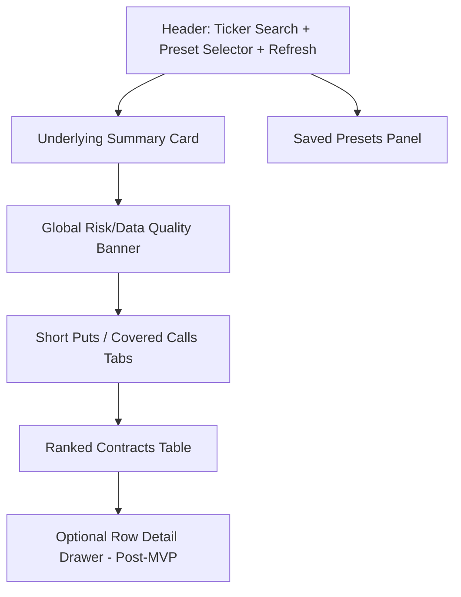

# Wheel Strategy Dashboard — Frontend UX Technical Specification

**Frontend:** React / Next.js / TypeScript  
**Design stance:** Modern financial terminal, not raw brokerage table  
**Primary UX goal:** Help users quickly identify disciplined wheel candidates without hiding risk.

---

## 1. UX Principles

1. Risk is visible before yield-chasing behavior is rewarded.
2. The default view should be useful without deep options expertise.
3. Tables should be dense but readable.
4. Every warning must be visible as a badge/icon/message, not buried in a tooltip only.
5. Data freshness must be obvious.
6. The UI should feel fast even when REST data is cached or refreshing.

---

## 2. Recommended UI Stack

- Next.js App Router
- React Server Components where useful
- Client components for dashboard interactions
- TypeScript strict mode
- Tailwind CSS
- shadcn/ui or Radix UI primitives
- TanStack Table for ranked contract tables
- TanStack Query or SWR for REST request state and cache awareness
- Recharts or lightweight charting only if small visual context is added

---

## 3. Primary Page Layout



---

## 4. Header Controls

Required controls:

- Ticker search input.
- Strategy persona selector.
- Saved preset selector.
- Analyze button.
- Refresh button.
- Data freshness label.

Ticker search behavior:

- Auto-uppercase input.
- Validate non-empty alphanumeric symbol.
- Submit on Enter.
- Show “No options found” state if Alpaca returns no chain.

---

## 5. Underlying Summary Card

Display:

- Current/last underlying price.
- Trend: bullish / neutral / bearish.
- RSI-14.
- MA20 / MA50 / MA200.
- Data feed: OPRA / indicative.
- Data timestamp.
- Earnings date/status if known.

Example copy:

```text
AAPL $192.34 · Bullish · RSI 61 · Above 20/50/200 DMA · OPRA data · As of 1:45 PM ET
```

---

## 6. Result Tabs

Tabs:

- Short Puts
- Covered Calls

Each tab should maintain independent table state but share the same analysis response.

---

## 7. Ranked Contract Table Columns

### Required Columns

- Rank
- Score
- Contract symbol
- Strike
- Expiration
- DTE
- Bid
- Ask
- Midpoint
- Premium yield
- Annualized yield
- Delta
- Theta
- IV
- Volume
- Open interest
- Spread quality
- Assignment quality / Upside cap quality
- Warnings

### Mobile / Narrow Layout

On small screens, collapse into cards showing:

- Rank + score.
- Strike + expiration + DTE.
- Premium yield + annualized yield.
- Delta + midpoint.
- Warning badges.
- Expand for details.

---

## 8. Visual Priority

Use visual hierarchy:

1. Score/rank.
2. Strike + expiration + DTE.
3. Premium/yield.
4. Risk badges.
5. Greeks/liquidity.

Do not over-color green yield values if risk warnings are severe. Yield should not visually dominate risk.

---

## 9. Warning Badges

Required warning badge types:

- Earnings
- High IV
- Wide spread
- Bearish trend
- Tight upside cap
- Data quality / indicative feed
- Earnings unknown

Severity palette:

- `info`: neutral/blue/gray
- `warning`: amber
- `danger`: red

Example display:

```text
[Wide spread] [Earnings before expiration]
```

---

## 10. Empty States

### No Contracts Found

```text
No contracts matched this preset.
Try widening DTE, delta, or liquidity filters.
```

### No Options Available

```text
No option chain was returned for this ticker.
Confirm the symbol supports listed options.
```

### Provider Rate Limited

```text
Market data provider rate limit reached. Showing cached data from 1:42 PM ET.
```

### Earnings Unknown

```text
Earnings date unavailable. Verify before trading.
```

---

## 11. Saved Preset UX

MVP requirements:

- Save current filters as preset.
- Load existing preset.
- Rename preset.
- Delete preset.
- Reset to system persona defaults.
- Keep public screening usable when the user is signed out.
- Gate account-owned save/delete controls when the preset API returns
  `UNAUTHENTICATED` or `PROFILE_INCOMPLETE`.
- Show loading, empty, save success, delete success, and recoverable API error
  states inside the preset panel.
- Provide a sign-in/profile CTA that returns to `/screeners` after auth or
  profile completion.

Custom preset panel fields:

- Preset name.
- Base persona.
- DTE min/max.
- Delta min/max.
- Minimum premium yield.
- Minimum volume.
- Minimum open interest.
- Max spread % of midpoint.
- Earnings treatment.

---

## 12. REST Loading Behavior

Use request states:

- `idle`
- `loading`
- `successFresh`
- `successStale`
- `refreshing`
- `errorWithCache`
- `errorNoCache`

UI must distinguish initial loading from background refresh.

---

## 13. Accessibility Requirements

- Full keyboard navigation for search, tabs, presets, and table actions.
- Warning badges must have accessible labels.
- Do not encode risk with color alone.
- Table headers are semantic and sortable buttons are screen-reader clear.
- Loading states should not trap focus.
- Account navigation controls must expose signed-out, loading, signed-in,
  incomplete-profile, logout pending, logout success, and logout error states
  without clipping at mobile widths.

---

## 14. Frontend Acceptance Criteria

- User can search a ticker and see short put/covered call tabs.
- User can switch personas and see the table rerank.
- User can save and reload a filter preset.
- User can identify account/session state from home, dashboard, and account
  surfaces.
- User can sign out from app navigation, clearing visible account-owned preset
  state.
- Every row shows visible warnings when present.
- Data feed and freshness timestamp are visible.
- Rate-limit/stale-cache states are understandable.
- No Alpaca credential is present in browser-visible code or network calls.
