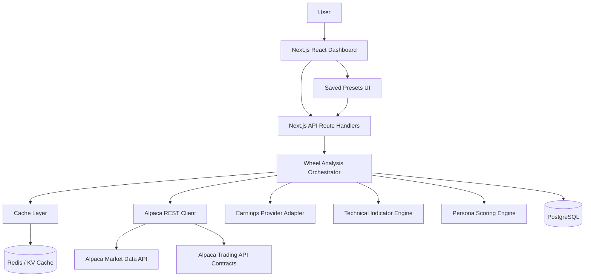
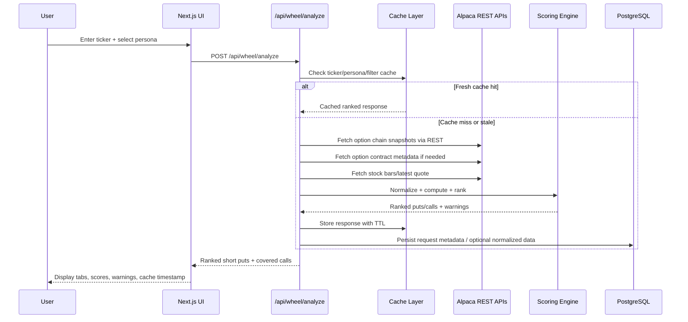

# Wheel Strategy Dashboard — Technical Architecture Specification

**Status:** Draft for engineering review  
**Source BRD:** `wheel-strategy-dashboard-brd` dated 2026-05-25  
**Primary constraint:** MVP is REST-first. No WebSocket dependency.  
**Target stack:** React + Next.js + Node.js + TypeScript

---

## 1. Purpose

This document translates the Wheel Strategy Dashboard BRD into an engineering-ready technical architecture for an MVP that ranks short put and covered call candidates for a single ticker.

The application is not a raw options chain viewer. It is a REST-backed decision dashboard that fetches Alpaca market data, enriches it with technical/risk calculations, applies persona-specific scoring, and returns ranked wheel candidates.

---

## 2. Architectural Decision Summary

### 2.1 Recommended MVP Architecture

Use a **Next.js TypeScript monolith with server-side API routes / route handlers** for the MVP.

Recommended deployment shape:

- **Frontend:** Next.js App Router, React, TypeScript, Tailwind CSS, shadcn/ui or equivalent accessible component primitives.
- **Backend/API:** Next.js route handlers or a colocated Node.js TypeScript service layer.
- **Database:** PostgreSQL for saved presets, request audit metadata, cached normalized snapshots, and future user accounts.
- **Cache:** Redis-compatible cache where available; otherwise database-backed cache is acceptable for local MVP.
- **External data:** Alpaca REST APIs only for MVP.
- **No WebSockets:** All data refreshes occur through explicit REST requests, cache TTLs, stale-while-revalidate behavior, and optional manual refresh.

### 2.2 Why Next.js for MVP

Next.js is preferred over a separate React + Express split for the first build because it provides:

- React frontend and Node.js backend in one TypeScript codebase.
- Server-side secret isolation for Alpaca credentials.
- Simple API route composition for ticker search and presets.
- Fast iteration on dashboard UX.
- Easy future extraction of backend services if request volume grows.

If the backend later needs independent scaling, extract the service layer into a standalone Node.js API without changing the domain model.

---

## 3. Key Non-Negotiables

1. **Do not call Alpaca directly from the browser.** API keys stay server-side.
2. **Do not depend on WebSockets for MVP.** REST + caching is sufficient.
3. **Do not make highest premium the default ranking.** Scoring must be risk-adjusted by persona.
4. **Do not place trades in MVP.** The system is decision support only.
5. **Do not hide risk warnings.** Earnings, liquidity, IV, trend, and upside-cap warnings must be visible.
6. **Do not require portfolio connection.** Covered call views are theoretical until portfolio-aware support exists.

---

## 4. External API Integration: Alpaca REST

### 4.1 Verified Alpaca Endpoints

The MVP should use these Alpaca REST surfaces:

#### Option Chain Snapshots

`GET https://data.alpaca.markets/v1beta1/options/snapshots/{underlying_symbol}`

Purpose:
- Fetch latest trade, latest quote, and greeks for option contracts on a single underlying.

Important parameters:
- `feed`: `opra` or `indicative`
- `limit`: 1–1000, default 100
- `page_token`: pagination
- `updated_since`: RFC-3339 or `YYYY-MM-DD`
- `type`: `call` or `put`
- `strike_price_gte`
- `strike_price_lte`
- `expiration_date`
- `expiration_date_gte`
- `expiration_date_lte`
- `root_symbol`

Use this as the primary MVP chain source because the dashboard searches one ticker at a time.

#### Option Snapshots by Contract Symbols

`GET https://data.alpaca.markets/v1beta1/options/snapshots`

Purpose:
- Fetch snapshots for explicitly provided option symbols.

Important parameters:
- `symbols`: comma-separated contract symbols, max 100
- `feed`
- `updated_since`
- `limit`
- `page_token`

Use this for cache refreshes of already ranked/visible contracts, not as the first chain discovery path.

#### Option Contract Metadata

`GET https://paper-api.alpaca.markets/v2/options/contracts`

Purpose:
- Retrieve contract metadata, including expiration, strike, type, style, status, open interest where available, and contract identity.

Important parameters:
- `underlying_symbols`
- `status`
- `expiration_date`
- `expiration_date_gte`
- `expiration_date_lte`
- `type`
- `style`
- `strike_price_gte`
- `strike_price_lte`
- `limit` up to 10000
- `page_token`

Use this when the option chain snapshot response does not include all required metadata, especially open interest.

#### Stock Market Data

Use Alpaca stock market data endpoints for underlying context:

- Historical bars: `GET https://data.alpaca.markets/v2/stocks/bars`
- Single-symbol historical bars: `GET https://data.alpaca.markets/v2/stocks/{symbol}/bars`
- Latest quote: `GET https://data.alpaca.markets/v2/stocks/quotes/latest`
- Latest bar: `GET https://data.alpaca.markets/v2/stocks/bars/latest`

Use daily bars to compute:
- 20-day moving average
- 50-day moving average
- 200-day moving average
- RSI-14
- trend classification

### 4.2 Alpaca Feed Strategy

Support a server config value:

```text
ALPACA_OPTIONS_FEED=opra | indicative
```

Behavior:
- If Rob’s account has OPRA access, use `opra`.
- If not, fall back to `indicative` and show a data-quality banner in the UI.
- Never silently mix feeds in one result set.

### 4.3 Data Not Guaranteed by Alpaca

The BRD requires earnings warnings. Alpaca’s referenced option/stock market data APIs should not be assumed to provide complete upcoming earnings calendar coverage.

MVP recommendation:
- Add an `EarningsProvider` interface.
- Implement one adapter behind it.
- If no provider is connected, return `earningsStatus: unknown` and show a softer warning: “Earnings date unavailable — verify before trading.”

Candidate future providers:
- Financial Modeling Prep
- Finnhub
- Polygon
- Nasdaq calendar source
- Manual CSV/import fallback for MVP testing

---

## 5. System Components



### 5.1 Frontend Dashboard

Responsibilities:
- Ticker input and validation.
- Strategy persona selection.
- Filter controls.
- Short Put / Covered Call tabs.
- Ranked contract table.
- Visible warning badges.
- Saved preset management.
- Loading, stale-data, empty-state, and error UX.

### 5.2 API Layer

Responsibilities:
- Validate request payloads.
- Enforce rate limits per user/session/IP.
- Keep Alpaca credentials server-side.
- Return normalized responses to frontend.
- Expose cache metadata to UI.

### 5.3 Wheel Analysis Orchestrator

Responsibilities:
- Resolve selected persona defaults.
- Build Alpaca query windows.
- Fetch option chain snapshots.
- Fetch or hydrate option metadata.
- Fetch underlying bars/quote.
- Fetch earnings date if provider exists.
- Normalize raw data.
- Compute metrics.
- Apply filters.
- Score/rank contracts.
- Return short put and covered call result sets.

### 5.4 Alpaca REST Client

Responsibilities:
- Auth headers.
- Pagination.
- Retry/backoff on 429/5xx.
- Feed selection.
- Request logging without secrets.
- Response normalization.

### 5.5 Cache Layer

Responsibilities:
- Prevent repeated Alpaca calls for identical ticker/persona/filter windows.
- Support stale-while-revalidate semantics.
- Cache by data category with separate TTLs.
- Surface `asOf`, `cacheStatus`, and `refreshAvailable` values to UI.

### 5.6 Scoring Engine

Responsibilities:
- Pure TypeScript functions.
- Deterministic scoring from normalized inputs.
- Persona-specific weights.
- Separate hard filters from ranking penalties.
- Emit score components for future explainability, even if hidden in MVP.

---

## 6. REST-First Request Flow



---

## 7. Caching Strategy

The app needs accurate-enough data, not tick-by-tick streaming. Caching is a product feature, not a compromise.

### 7.1 Cache Keys

Use stable cache keys:

```text
wheel:v1:{feed}:{ticker}:{persona}:{strategyType}:{filtersHash}
stock-bars:v1:{ticker}:{timeframe}:{start}:{end}
stock-quote:v1:{feed}:{ticker}
option-chain:v1:{feed}:{ticker}:{type}:{expirationStart}:{expirationEnd}:{strikeMin}:{strikeMax}
option-contracts:v1:{ticker}:{type}:{expirationStart}:{expirationEnd}:{strikeMin}:{strikeMax}
earnings:v1:{ticker}
```

### 7.2 Recommended TTLs

| Data | TTL | Notes |
|---|---:|---|
| Option chain snapshots | 60–180 seconds | Short TTL during market hours; longer after close. |
| Underlying latest quote/bar | 30–120 seconds | Not real-time critical. |
| Historical daily bars | 6–24 hours | Recompute MAs/RSI from daily bars. |
| Contract metadata/open interest | 1–6 hours | OI does not need second-level freshness. |
| Earnings date | 12–24 hours | Refresh daily unless provider changes. |
| Saved presets | Persistent | User/config data, not market data. |

### 7.3 Stale-While-Revalidate

For dashboard responsiveness:

1. Return stale cached response if it is within a configured stale window.
2. Include `cacheStatus: stale` and `asOf` timestamp.
3. Trigger background refresh if supported by deployment.
4. Allow manual refresh button.

### 7.4 Rate Limit Behavior

On Alpaca `429`:

- Respect `X-RateLimit-*` headers when available.
- Serve stale cache if available.
- Return a user-friendly warning if no usable cache exists.
- Do not retry in a tight loop.

---

## 8. MVP Analysis Pipeline

For each search request:

1. Normalize ticker to uppercase.
2. Resolve persona config and filters.
3. Fetch underlying latest price.
4. Fetch daily bars sufficient for 200-day MA and RSI.
5. Compute technical context.
6. Determine expiration window from persona DTE range.
7. Fetch option chain snapshots for puts and calls separately.
8. Fetch option contract metadata if OI/contract fields are missing.
9. Join snapshots + metadata by contract symbol.
10. Compute per-contract metrics.
11. Apply hard exclusions.
12. Apply persona-specific scoring.
13. Generate visible warnings.
14. Return ranked short puts and covered calls.

---

## 9. Hard Filters vs Score Penalties

### 9.1 Hard Filters

Use hard filters only for conditions that make a row unusable for the selected view:

- Missing bid/ask.
- Bid <= 0.
- Ask <= 0.
- DTE outside selected range.
- Wrong option type for tab.
- Put strike above spot for short-put tab, unless user explicitly allows ITM.
- Call strike below spot for covered-call tab, unless user explicitly allows ITM.
- Expired contract.

### 9.2 Score Penalties

Use score penalties for risk context:

- Earnings before expiration.
- Weak liquidity.
- Wide spread.
- High IV.
- Bearish trend for short puts.
- Aggressive upside cap for covered calls.
- Delta outside persona target.
- Yield below target.
- Strike technically weak versus moving averages.

---

## 10. MVP Deployment Options

### Option A — Simple Vercel MVP

- Next.js app on Vercel.
- Vercel Postgres or Supabase Postgres.
- Vercel KV / Upstash Redis.
- Cron/background refresh optional.

Best for: fastest MVP.

### Option B — Next.js + Railway Node Worker

- Next.js frontend/API on Vercel.
- Railway worker for background refresh and heavier data processing.
- Supabase Postgres.
- Upstash Redis.

Best for: heavier refresh workloads and future scanner support.

### Recommendation

Use **Option A** for single-ticker MVP. Keep service boundaries clean so Option B is easy later.

---

## 11. Security and Compliance Notes

- Store Alpaca keys only in server-side environment variables.
- Never expose raw Alpaca auth headers to the browser.
- Add a visible “decision support only / not financial advice” disclaimer.
- Log external API failures without logging secrets.
- Do not allow trade placement routes in MVP.
- Avoid language that guarantees profitability.

---

## 12. Open Decisions

1. Which earnings provider should be used for MVP?
2. Does Rob’s Alpaca account have OPRA options data access, or should default feed be `indicative`?
3. Should saved presets require authentication in MVP, or can they be local/session-scoped first?
4. Should the MVP persist normalized market snapshots, or only cache them ephemerally?

---

## 13. Engineering Acceptance Criteria

- User can submit ticker + persona through a REST endpoint.
- Backend fetches options/stock data via Alpaca REST only.
- Backend returns ranked short puts and covered calls.
- Response includes cache timestamp and data feed used.
- No browser code contains Alpaca keys.
- No WebSocket connection is required for dashboard function.
- Rankings change when persona changes.
- Warnings are returned as structured objects and rendered visibly.
- Saved presets persist and can be reused.
